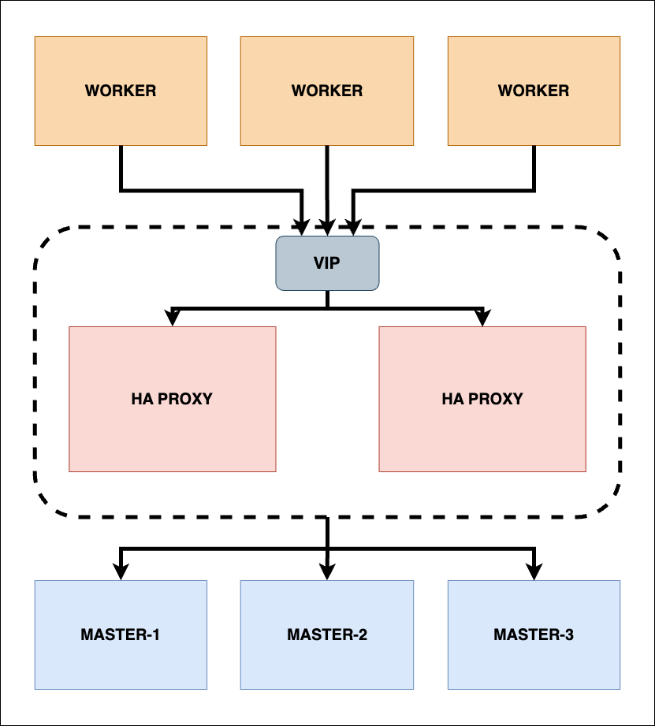

# Production setup

K8S cluster Topology



## Prerequired

System: **Ubuntu 20.04.5 LTS**

- 2 ha machines
- 3 control plane nodes
- 3 worker nodes

Example:

| name            | public ip       | private ip     | LAN ip     | LAN ip        |
| --------------- | --------------- | -------------- | ---------- | ------------- |
| ha-1            | 123.124.125.12x | 72.87.67.7x    | 10.142.2.1 | 1CPU, 2GB RAM |
| ha-2            | 123.124.125.12x | same with ha-1 | 10.142.2.2 | 1CPU, 2GB RAM |
| control-plane-1 | 123.124.125.12x | not required   | 10.142.2.3 | 2CPU, 4GB RAM |
| control-plane-2 | 123.124.125.12x | not required   | 10.142.2.4 | 2CPU, 4GB RAM |
| control-plane-3 | 123.124.125.12x | not required   | 10.142.2.5 | 2CPU, 4GB RAM |
| worker-1        | 123.124.125.12x | not required   | 10.142.2.6 | 1CPU, 2GB RAM |
| worker-2        | 123.124.125.12x | not required   | 10.142.2.7 | 1CPU, 2GB RAM |
| worker-3        | 123.124.125.12x | not required   | 10.142.2.8 | 1CPU, 2GB RAM |

## Installation

### 1. Setup utilities

#### 1.a. Setup hostname

Connect to each machine and setup hostname

Change hostname without restart

```
hostname <new_hostname>
```

Edit `/etc/hostname`

Add `127.0.0.1  <new_hostname>` to `/etc/hosts`

#### 1.b. Setup docker, containerd, etc

Setup for `control-plane-1`, `control-plane-2`, `control-plane-3`, `worker-1`, `worker-2`, `worker-3`

See [Setup cluster](../SETUP_CLUSTER.md), From beginning to step **Install kubeadm, kubelet, and kubectl**

### 2. Setup ha and failover on 2 high availabilities nodes

#### 2.a. Install HAproxy

Install HAproxy

```
apt update && apt install haproxy -y

```

Setup HAProxy

Edit file: `/etc/haproxy/haproxy.cfg`:

```
global
    log /dev/log  local0 warning
    chroot      /var/lib/haproxy
    pidfile     /var/run/haproxy.pid
    maxconn     4000
    user        haproxy
    group       haproxy
    daemon

   stats socket /var/lib/haproxy/stats

defaults
    mode                    http
    log                     global
    option                  httplog
    option                  dontlognull
    option http-server-close
    option forwardfor       except 127.0.0.0/8
    option                  redispatch
    retries                 1
    timeout http-request    10s
    timeout queue           20s
    timeout connect         5s
    timeout client          20s
    timeout server          20s
    timeout http-keep-alive 10s
    timeout check           10s
frontend kube-apiserver
  bind *:6443
  mode tcp
  option tcplog
  default_backend kube-apiserver

backend kube-apiserver
    mode tcp
    option httpchk GET /healthz
    http-check expect status 200
    option tcplog
    option tcp-check
    balance roundrobin
    # default-server inter 10s downinter 5s rise 2 fall 2 slowstart 60s maxconn 250 maxqueue 256 weight 100
        server kube-apiserver-1 <LAN_ip_control_plan_1>:6443 check # Replace the IP address with your own.
        server kube-apiserver-2 <LAN_ip_control_plan_2>:6443 check # Replace the IP address with your own.
        server kube-apiserver-3 <LAN_ip_control_plan_3>:6443 check # Replace the IP address with your own.
```

Restart HAproxy

```
sudo systemctl restart frr
```

Verify:

```
nc -v localhost 6443
```

Expect `success` from output

#### 3.b. Setup failover (Linode)

Setup 2 machine HA using 1 private IP.

Install FRR

Set the FRR environment variable to the version you would like to install. The possible values are frr-6, frr-7, frr-8, and frr-stable, though it is recommended to use `frr-stable` to install the latest stable version.

```
FRRVER="frr-stable"
```

_Note_
For more information on FRR versions, see the FRR Debian repository and FRR’s Github Releases.
If you’re running an older Debian-based system, you may need to install the packages below, which come default with most modern Debian-based distributions.

```
sudo apt update && sudo apt install apt-transport-https gnupg
```

Add FRR’s GPG key:

```
curl -s https://deb.frrouting.org/frr/keys.asc | sudo apt-key add -
```

Add FRR’s Debian repository to your system’s source’s list:

```
echo deb https://deb.frrouting.org/frr $(lsb_release -s -c) $FRRVER | sudo tee -a /etc/apt/sources.list.d/frr.list
```

Install FRR:

```
sudo apt install frr frr-pythontools
```

Configure FRR

With FRR installed, you can now configure it to enable IP failover.

FRR works using a variety of protocols. Since we’re using FRR for its BGP support, the next step is to explicitly enable the bgpd daemon. Using a text editor of your choice, enable the bgpd daemon by updating its value to yes in the FRR daemons configuration file:

File: `/etc/frr/daemons`

```
bgpd=yes
```

Gather the following information, which is required for the next step:

- **Shared IP address** (`[SHARED_IP]`): The IPv4 address you shared or an address from the IPv6 range that you shared. You can choose any address from the IPv6 range. For example, within the range 2001:db8:e001:1b8c::/64, the address 2001:db8:e001:1b8c::1 can be used.
- **Prefix** (`[PREFIX]`): For an IPv4 address, use 32. For an IPv6 address, use either 56 or 64 depending on the size of the range you are sharing.
- **Protocol** (`[PROTOCOL]`): Use `ipv4` when sharing an IPv4 address and `ipv6` when sharing an IPv6 address.
- **Hostname** (`[HOSTNAME]`): The hostname defined on the Compute Instance you are configuring (ex: atl-bgp-1).
- **Role** (`[ROLE]`): The role of this Compute Instance within your failover strategy.
  - `primary`: All requests are routed to this Compute Instance, provided it is accessible.
  - `secondary`: If the primary instance fails, all requests are routed to this Compute Instance, provided it is accessible.
- **Data center ID** (`[DC_ID]`): The ID of your data center. See IP Sharing Availability for the corresponding ID.
  Edit the `/etc/frr/frr.conf` file and add the following lines. Ensure you replace any instances of `[SHARED_IP]`, `[HOSTNAME]`, `[ROLE]`, and `[DC_ID]` as outlined above.

File: `/etc/frr/frr.conf`

```
hostname [HOSTNAME]

router bgp 65001
no bgp ebgp-requires-policy
coalesce-time 1000
bgp bestpath as-path multipath-relax
neighbor RS peer-group
neighbor RS remote-as external
neighbor RS ebgp-multihop 10
neighbor RS capability extended-nexthop
neighbor 2600:3c0f:[DC_ID]:34::1 peer-group RS
neighbor 2600:3c0f:[DC_ID]:34::2 peer-group RS
neighbor 2600:3c0f:[DC_ID]:34::3 peer-group RS
neighbor 2600:3c0f:[DC_ID]:34::4 peer-group RS

address-family [PROTOCOL] unicast
  network [SHARED_IP]/[PREFIX] route-map [ROLE]
  redistribute static
exit-address-family

route-map primary permit 10
  set community 65000:1
route-map secondary permit 10
  set community 65000:2

ipv6 nht resolve-via-default
```

Restart the FRR service:

```
sudo systemctl restart frr
```

Verify

Connect to one of `control-plane` nodes and ping to `SHARED_IP`

Turn of `ha-1` machine and ping command still work

### 4. Setup control plane node

Choose one control plane node and use `kubeadm` to init k8s cluster.

Run init command

```
sudo kubeadm init --cri-socket=unix:///var/run/containerd/containerd.sock --control-plane-endpoint "<VIP_HA>:<port_ha>" --upload-certs
```

with `VIP_HA` is private IP shared by 2 HAproxy we configurated at the previous step. And `port` is configurated at `haproxy.cfg`.

Example:

```
sudo kubeadm init --cri-socket=unix:///var/run/containerd/containerd.sock --control-plane-endpoint "192.127.123.25:6443" --upload-certs
```
